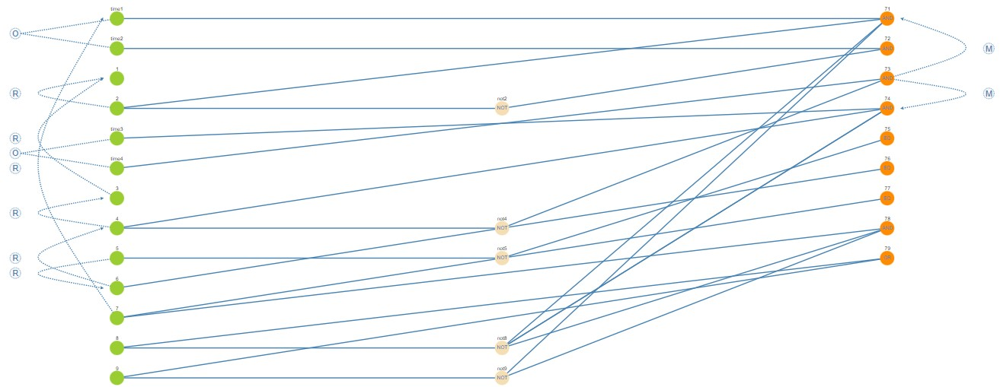
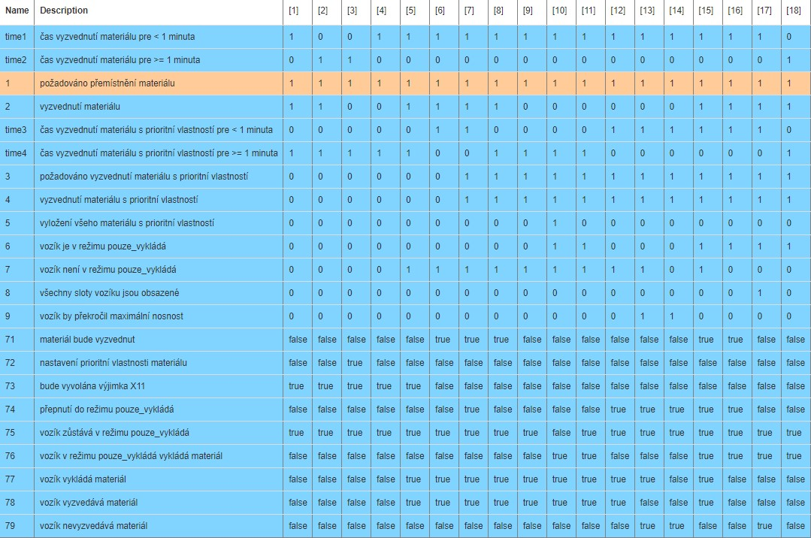
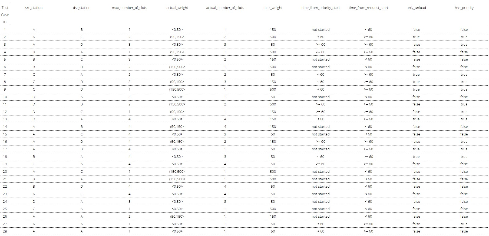

# Dokumentácia testov

## 1. CEG

### CEG Graf

### CEG Rozhodovacia tabuľka

## 2. Identifikácia vstupných parametrov
| Identifikátor parametrov | Stručný popis |
| ------------- |:-------------:|
| `src_station`   |  Stanica odkiaľ vozík vyzdvihol materiál   |
| `dst_station`     | Stanica kde vozík vyložil materiál     |
| `max_weight`      | Maximálna nosnosť vozíku    |
| `max_number_of_slots`     | Maximálny počet slotov vozíku   |
| `actual_weight`      | Aktuálna hmotnosť materiálu vo vozíku  |
| `actual_number_of_slots`     | Aktuálny počet obsadených slotov vo vozíku    |
| `only_unload`     | Je v režíme vykladania     |
| `has_priority`  | Má prioritnú vlastnosť  |
| `time_from_request_start`    | Čas od začiatku požiadavku na vyzdvihnutie    |
| `time_from_priority_start`  | Čas od začiatku nastavenia prioritnej vlastnosti     |

## 3. Charakteristiky parametrov

| `src_station` |  Zdrojová stanica  |
| ------------- |:-------------:|
| 1 | A  |
| 2 | B  |
| 3 | C  |
| 4 | D  |

| `dst_station` |  Cieľová stanica  |
| ------------- |:-------------:|
| 1 | A  |
| 2 | B  |
| 3 | C  |
| 4 | D  |

| `max_weight` |  Maximálna hmotnosť vozíku v KG  |
| ------------- |:-------------:|
| 1  | 50  |
| 2  | 150  |
| 3  | 500  |

| `max_number_of_slots` |  Maximálny počet slotov vozíku  |
| ------------- |:-------------:|
| 1  | 1  |
| 2  | 2  |
| 3  | 3  |
| 4  | 4  |

| `actual_weight` |  Aktuálna hmotnosť vozíku v KG  |
| ------------- |:-------------:|
| 1  | <0,50>  |
| 2  | (50,150>  |
| 3  | (150,500>  |
| 4  | (500,infinity)  |

| `actual_number_of_slots` |  Aktuálny počet slotov vozíku  |
| ------------- |:-------------:|
| 1  | 1  |
| 2  | 2  |
| 3  | 3  |
| 4  | 4  |

| `only_unload` |  Je v režíme iba vykladania?  |
| ------------- |:-------------:|
| 1  | true  |
| 2  | false  |

| `has_priority` |  Je v prioritnom režíme?  |
| ------------- |:-------------:|
| 1  | true  |
| 2  | false  |

| `time_from_request_start` |  Čas od zadania požiadavku v sekundách  |
| ------------- |:-------------:|
| 1  | < 60  |
| 2  | >= 60  |

| `time_from_priority_start` |  Čas od nastavenia priority požiadavku v sekundách   |
| ------------- |:-------------:|
| 1  | not started |
| 2  | < 60  |
| 3  | >= 60  |

### Obmedzenia
<!-- max_weight.1 -> !max_number_of_slots.1

max_weight.3 -> !max_number_of_slots.3

max_weight.3 -> !max_number_of_slots.4

src_station.1 -> !dst_station.1

src_station.2 -> !dst_station.2

src_station.3 -> !dst_station.3

src_station.4 -> !dst_station.4

actual_weight.4 -> !max_weight.1

actual_weight.4 -> !max_weight.2

actual_weight.4 -> !max_weight.3

time_from_request_start.2 -> !has_priority.2

only_unload.1 -> !time_from_priority_start.2 -->

src_station.1 -> !dst_station.1

src_station.2 -> !dst_station.2

src_station.3 -> !dst_station.3

src_station.4 -> !dst_station.4

time_from_request_start.1 -> has_priority.2

only_unload.1 -> !time_from_priority_start.3

time_from_request_start.1 -> time_from_priority_start.1

only_unload.1 -> has_priority.1

max_number_of_slots.1 -> !actual_number_of_slots.2 and  !actual_number_of_slots.3 and  !actual_number_of_slots.4

max_number_of_slots.2 -> !actual_number_of_slots.3 and  !actual_number_of_slots.4

max_number_of_slots.3 ->  !actual_number_of_slots.4

max_weight.1 -> actual_weight.1 and !max_number_of_slots.1

max_weight.2 -> actual_weight.1 or actual_weight.2

max_weight.3 -> actual_weight.1 or actual_weight.2 or actual_weight.3

max_weight.3 -> max_number_of_slots.1 or  max_number_of_slots.2

max_number_of_slots.1 -> !max_weight.1 

## Kombinácie dvojíc blokov

## Testy kombinácie blokov
Boli implementované nasledujúce testy podľa kombinačných dvojíc blokov:

Test case ID 1

Test case ID 5

Test case ID 10

Test case ID 18

Test case ID 21

